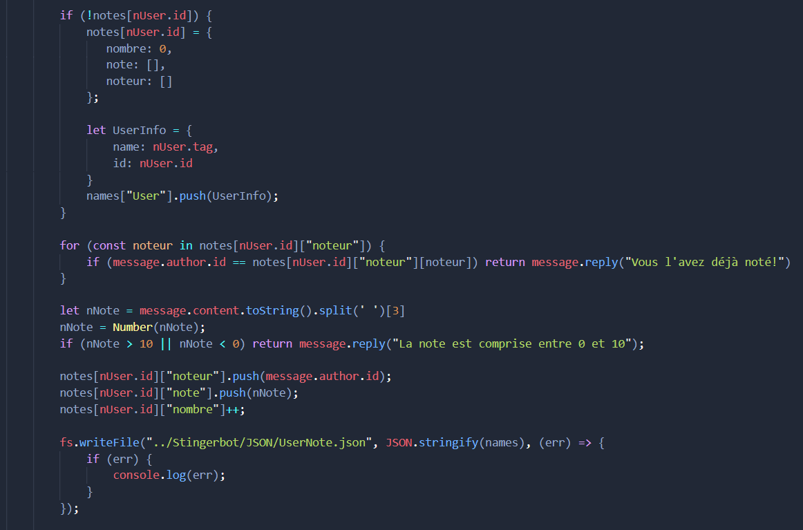

# StingerBot

<p align="center">
  
</p>

<div align="center">
  
  
  
  
</div>
<br>

StingerBot is a little Bot created by THEVBAT with the help of **Bat-Husky The Magnificent**.

## Installation

Add StingerBot to your server by clicking here : [Invite Link](https://discord.com/oauth2/authorize?client_id=835577703884521523&scope=bot&permissions=8)

## Setup

Download this code, put your information in JSON/config.json or it will not work. Finally, launch the bot with **nodejs** as below.

```bash
node index.js
```

## Usage

List of the main commands :

```
./infobot
./help
```

# An EcoDigital project

StingerBot is lovingly programmed with respect for the environment


